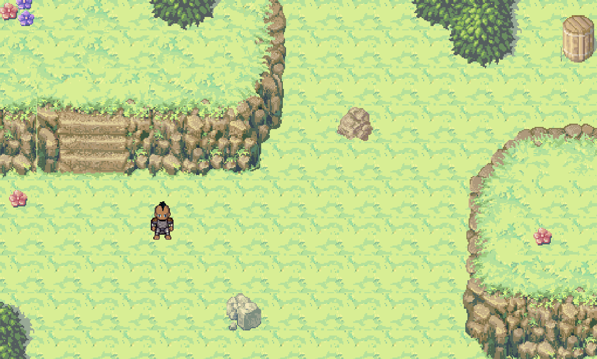
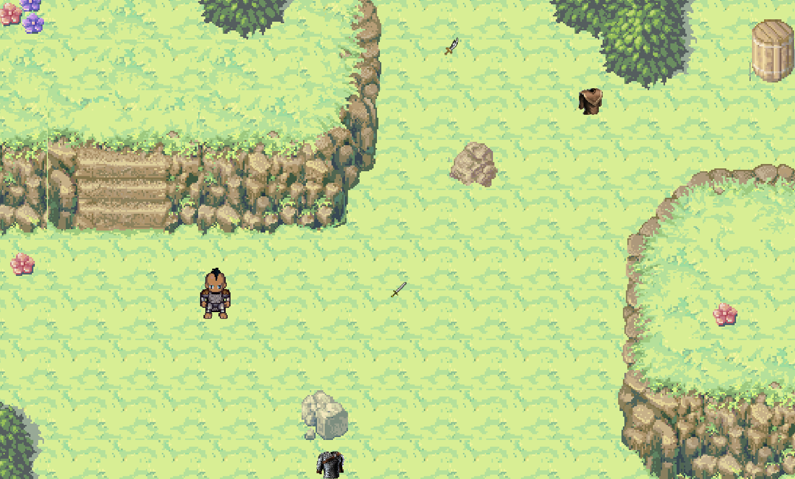
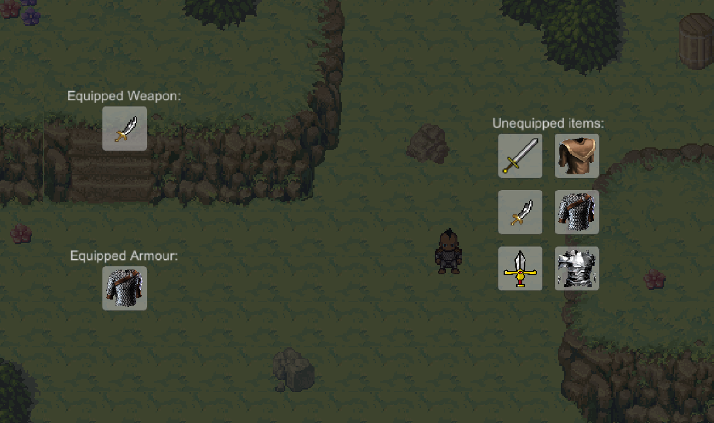

# Lab 02/03

## Overview

For this lab, you will create a top-down game which allows the player to collect various items and equip those items in an inventory.  Your level will have item pick-ups which contain pieces of armour, or weapons for your character to equip.  You will create an inventory interface which will allow you to select which armour items and weapons to equip.

_**Note:** This lab carries double weight, and will take place over a two-week period.  It is strongly recommended that you complete one part each week, to maximize the opportunity to get help from your lab instructor._

### Gathering Assets

Collect a sprite sheet from any source online.  You can design your own custom sprite sheet at the following website:  

- http://gaurav.munjal.us/Universal-LPC-Spritesheet-Character-Generator/

You will also need an image for at least two types of swords and at least two types of armour.  A set of ground tiles specifically for top-down games will also be required.  You can get these assets from anywhere you want, but here are a few good sources:

- https://opengameart.org/
- https://kenney.nl/assets?q=2d
- https://www.gameart2d.com/freebies.html

_**Note:** Ensure that you have the rights to use these sprites, including any attribution in your project as required._

## Part 1

For this part, you will create a simple level and will implement a controller/animated sprite for the player.

### Build Your Level

Using the techniques introduced in the lectures, use the tile palette to design a new 2D, top-down level.  You should have a ground layer, which has dirt, grass, road, water (or whatever you like), and one or more object layers with obstacles, trees, decorations, and treasure chests.

### Character Movement

Create a simple player control script which allows the character to move around the level using the arrow/WASD keys (or a gamepad).  Create an animation for walking, idle, and attacking.  Attacking will happen when the `Fire` button is pressed (which corresponds to the space bar or the primary gamepad button).  Use the animation frames in your sprite sheet for these animations.

## Part 2

For this part, you will add the item pick-ups, which will be spread around the level, and an inventory screen which will allow you to select various inventory items.

### Item Pick-ups

Create a new script, `Equipment`, which will have the following (public) fields:

- `type` (`string`) - either `weapon` or `armour`
- `description` (`string`) - a short, descriptive name for the item
- `defense` (`int`) - the increase in defense stat when equipping this item (for armour)
- `attack` (`int`) - the increase in attack stat when equipping this item (for weapons)
- `icon` (`Texture`) - the image to be displayed in the inventory screen

Create an item in the scene for each type of armour and weapon by dragging in the sprites for each.  Each such game object should be given the `Equipment` component, with the appropriate values set.  Create a game object for each of the images that you collected, including at least 2 weapons and 2 sets of armour, and scatter these objects around the map.

### Inventory System

Add a new script to the player, called `Inventory`.  This will store the following fields:

- `armour` (`Equipment`) - stores the `armour`-type item currently equipped
- `weapon` (`Equipment`) - stores the `weapon`-type item currently equipped
- `unequipped` (`List<Equipment>`) - a list of unequipped items

Add a `onTriggerEnter2D` event handler to this script, which will be triggered when the player makes contact with an `Equipment` item.  In this event handler, add the item being collected to the `unequipped` list.

### Inventory UI

When the `i` key is pressed, you will show a user interface that shows a list of all items in the player's possession (`unequipped`) and will show two boxes (one for armour and one for a weapon).  The background of this UI will be a 50% transparent medium gray.

These boxes will actually be buttons that, when clicked, will un-equip that weapon or armour.  Initially, there will be no weapon or armour equipped, and as such, both buttons will have no image.  The list of unequipped items will also be a grid of buttons (the size is up to you, but in the screenshot below I used 6 buttons).  When an unequipped item button (that contains a piece of equipment that the player picked up), it will make that the active weapon or armour (as appropriate).  In addition to setting the fields in the `Inventory` component of the player, you will also update the UI by setting the image in the appropriate button to the `icon` field of the selected item.  For each button in the inventory interface, create a corresponding event handler function in the `Inventory` component.  Drag these handlers into the corresponding `OnClick` handlers within Unity.

You will need to modify your trigger event handler to not only add the equipment to the `unequipped` list, but also add it to the corresponding image in the user interface.

_**Note:** You do not need to update the player's appearance when new items have been equipped.  You can, for additional challenge, if you want.  You also do not need to disable the player controls when the inventory screen is open._

## How to Submit

To submit this lab, you only need to commit and push your code to your copy of this repository.  It is advisable, especially if you are new to git and GitHub, to verify that your most up-to-date code appears on GitHub.