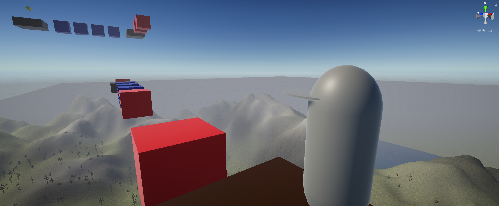

# Lab 04-06

## Overview

For this lab, you will create an outdoor environment, and a bunch of moving and/or rotating platforms, along with a 3rd person character to navigate them.  This mini-game will be a platforming challenge, inspired by the likes of Super Mario Sunshine (https://www.youtube.com/watch?v=rgqBJT48e8w).

_**Note:** This lab carries triple weight, and will take place over a three-week period.  It is strongly recommended that you complete one part each week, to maximize the opportunity to get help from your lab instructor._

### Gathering Assets

You will need some textures.  You can collect these using the usual asset sources:  

- https://opengameart.org/
- https://kenney.nl/assets?q=2d
- https://www.gameart2d.com/freebies.html
- the Unity asset store

There are also some texture-specific sources that you may wish to consider:

- https://cc0textures.com/
- https://www.poliigon.com/search?type=texture 
- https://www.textures.com/

If you want to create your own trees, you can download textures for those too (e.g. leaf and bark textures).

_**Note:** Ensure that you have the rights to use these assets, including any attribution in your project as required._

## Part 1

For this part, you will create a terrain with the following elements:

- mountains and valleys
- flat areas (especially for a larger building, later)
- at least one body of water (a river or a lake)
- a forested area (with more trees)
- a few free assets (e.g. cabins, ruins, rocks)
- multiple textures (e.g. snow-capped mountains, a path)

Recommended steps:

1. Shape the terrain (set height, use organic brushes to raise/lower, larger then smaller)

2. Texture the terrain (base texture, paint layers on top)

3. Add trees (e.g. using the Speed Trees package)

4. (Optional) Add a body of water (use free assets)

5. (Optional) Add additional assets (e.g. rocks, ruins)

## Part 2

For this part of the lab, we're going to create a complete platforming course, high above our terrain.  Our course will consist of rotating and sliding platforms, and a final collectible item at the end.

Create an empty game object (`PlatformerCourse`) about 40-50m above the surface of your terrain.  As children of `PlatformerCourse`, create some basic moving and rotating platforms.  It should be possible to jump between these platforms with a little skill/effort.  The sizes, shapes, and materials for these platforms will be up to you.

Create a script for `MovingPlatform`s and `RotatingPlatform`s.  `MovingPlatform` will slide back and forth (or up and down) between two waypoints, which will be settable within the Unity editor.  `RotatingPlatform` will rotate the platform around a specific axis (settable in the Unity editor).  The movement and rotation speeds should be tweakable within the editor, since game designers usually make these decisions, not game programmers.  You should also position some static platforms, to give the player a rest between challenging stretches.

_**Note:** Be sure not to add the waypoints as a child of the moving platform, since they will never reach those waypoints because the waypoints will move along with the moving platform!_

As for the design, you can use any existing platform challenge game for inspiration (including the Super Mario Sunshine levels linked, above), or you can design your own course.  To test your course, create a third-person controller (e.g. the one described in [this video](https://www.youtube.com/watch?v=4HpC--2iowE)).  You may need to adjust the jump distances to make it more/less challenging.

At the end of the course, place a collectable object of some kind (a star, a coin, a music note, anything you like) that when collected triggers a game over message (with a success message).  Add a Cube, as well, just below your course with the same size in X and Z as your terrain, with a trigger collider, which will also trigger a game over message (this time, with a failure message).  Hide the actual `MeshRenderer`, because we want an invisible collider.

## Part 3

For this part of the lab, we'll make our third person character animated (in a very basic way).  

### Collecting Assets

We'll need a character and the following animations for this part:
- idle
- run
- jump
- fall
- celebrate

_**Note:** You can use any characters and animations that you like, but it is recommended that you use those from mixamo.com._

### Animator

Replace your placeholder geometry in your third-person controller with your character, and give that character a new animator with the same name.  This animator will define the following parameters:
- Speed (float)
- Jump (trigger)
- Falling (trigger)
- Celebrate (trigger)

Each of the trigger events will transition to the corresponding animation.  The run animation will be run when not jumping, falling, or celebrating, and when the speed parameter is non-zero.  Add the animator as a configurable property of the `ThirdPersonCharacter` script, and have that script set the speed appropriately in the `Update()` method, as well as trigger the `Jump` trigger parameter.

The `EndGame` script will also need an animator parameter, which will set the `Celebrate` trigger parameter when the collectible item is touched, and the `Falling` trigger parameter when the falling collision box is touched.

## How to Submit

To submit this lab, you only need to commit and push your code to your copy of this repository.  It is advisable, especially if you are new to git and GitHub, to verify that your most up-to-date code appears on GitHub.