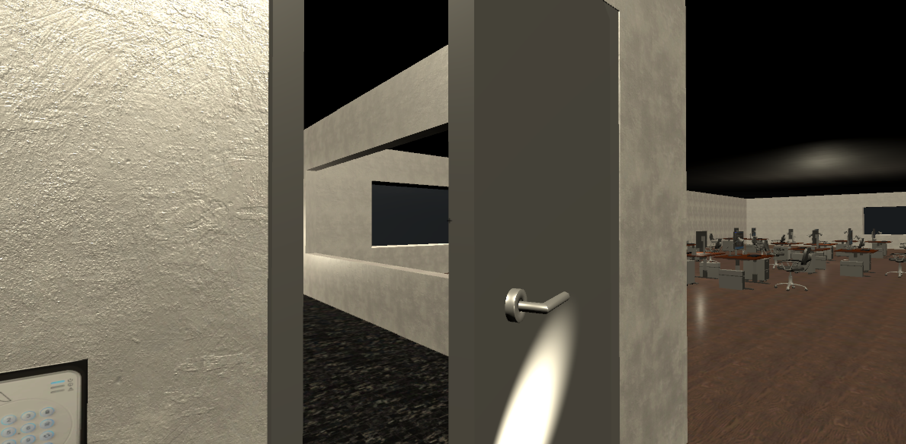

# Lab 07-10

## Overview

For this lab, you will create an indoor environment, including a first-person controller, shooting, visual effects, and interaction/puzzle elements.  This mini-game will implement a simple first-person shooter (FPS) game.

_**Note:** This lab carries quadruple weight, and will take place over a four-week period.  It is strongly recommended that you complete one part each week, to maximize the opportunity to get help from your lab instructor._

### Gathering Assets

You will need some textures.  You can collect these using the usual asset sources:  

- https://opengameart.org/
- https://kenney.nl/assets?q=2d
- https://www.gameart2d.com/freebies.html
- the Unity asset store

There are also some texture-specific sources that you may wish to consider:

- https://cc0textures.com/
- https://www.poliigon.com/search?type=texture 
- https://www.textures.com/

_**Note:** Ensure that you have the rights to use these assets, including any attribution in your project as required._

## Part 1

For this part, you will create a single-floor interior level.  Imagine that this is one floor of a skyscraper, all being occupied by the same company.  The rooms, floor, ceilings, walls, etc. will be created using ProBuilder, and the objects (e.g. desks, chairs, cabinets, lights) will come from the SNAPs prototype (office) pack or other free assets from the asset store.  Doors and windows will merely be openings (for now).  You can apply some basic textures to the map, but it doesn't need to be perfect.  

Required elements:

- an enclosed office (with one doorway, and at least one window)
- several cubicles/desks (with chairs, and other items on the desks)
- a staircase leading between the two floors

Some optional ideas:
- a central atrium (the second floor will open down to a garden on the main floor)
- elevators (not yet functional) and elevator shafts
- washrooms
- kitchen/break room

The office will be closed for the evening (and will eventually have patrolling guards), so it will be mostly dark except for a few lamps.  This mini-game will involve stealth elements, so there should be paths with cover and darkness between various locations on the map.

You will also create a basic player (using a first-person camera system).  This system will allow for forward/backward movement and crouching.  When crouching, the collider for the player will change to a shorter collider and the camera will move to a lower position.  It is possible to move while crouched.  The initial position for your first-person player should be within the stairway.

## Part 2

For this part of the lab, we're going to create a patrolling enemy.  Import a pin entry console texture, a rigged character, and the following animations:
 - run
 - walk
 - idle
 - enter code/press button

Create one or more pin entry consoles around your map using a basic shape (e.g. Cube) and the imported pin entry console texture.  Your enemy prefab will use NavMesh to patrol around a pre-defined set of waypoints.  The character will hold a flashlight (which could just be a cylinder), which will include a real spotlight as a child object. 

Make this enemy a prefab, and create at least 2 enemies with different patrol routes.

## Part 3

For this part of the lab, we'll add some basic enemy senses and behaviour.  You will create a basic shape (e.g. a Cube) with a pin code texture, to act as an alarm system, which the enemies will use when they spot the player.

The enemy will have a _vision_ trigger collider (e.g. a capsule collider), which will be 5m long protruding outward from about eye level. attached to the enemy's head in the skeleton.  An enemy _sees_ the player if the player collides with their vision collider.  If the enemy _sees_ the player, they become _alerted_ and then they will run toward the alarm pad and will enter the code, triggering an alarm.  

When _alerted_, the enemy will run to the nearest alarm point and will enter the code (i.e. play the enter code animation).  If this happens, a previously deactivated system of red lights will be activated, by enabling the (disabled by default) light component.

_**Note:** If you are using the Universal Render Pipeline, you will find that not all of your lights will shine at once.  This is experimental in URP, and to get this working properly, you can use the high definition render pipeline (HDRP)._

## Part 4

For this part of the lab, we'll add a few puzzle objectives to our level.

Add a door to the CEO's office which will be locked with a keypad.  The code for this keypad is not known to the player, initially.  The key code for the CEO's office will be accessed by using one of the computers, found in one of the cubicles elsewhere on the floor.  Some of those computers will get a new texture mapped onto the monitor, indicating that they are on.  Most computers will be off.  One of powered-on computers will have an interactable keyboard which, when activated, will add the code to the player's inventory.  This code will allow the player to interact with the keypad outside of the CEO's office, which will unlock the office door.

Inside the CEO's office, the CEO's computer will also be powered on.  When the keyboard of this computer is activated, the player will have the _secret plans_ to their inventory, which is their main objective.  When they return to the stairwell without being detected, then the level will have been completed successfully.

## How to Submit

To submit this lab, you only need to commit and push your code to your copy of this repository.  It is advisable, especially if you are new to git and GitHub, to verify that your most up-to-date code appears on GitHub.